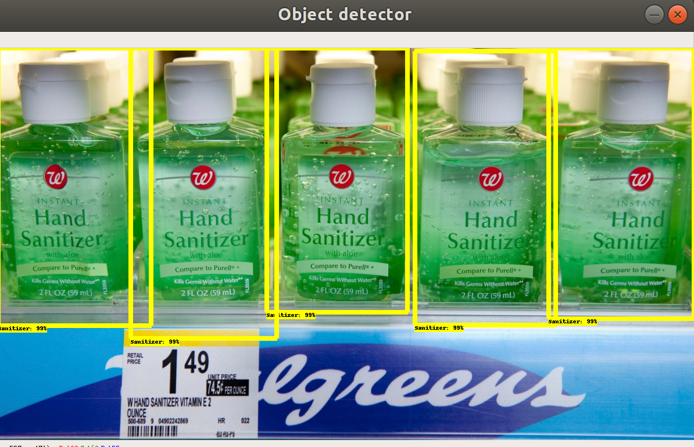

# Hand_Sanitizer_Clorox_Wipe_Detector
Short description: This model detects Purell hand sanitizer and Clorox wipes using Tensorflow Custom Object API with Python

## ***Urgent:*** Seeking a position as a software engineer in the Deep Learning/Computer Vision field. 

## Please contact me at kjzehnder@gmail.com for additional information if you are impressed by this project and feel that I could add value to your company. Thanks in advance.

## 1. Hand Sanitizer Clorox Wipes Detector ([click to view project code](SANITIZER/))

 Sample prediction #1      |  Sample prediction #2
:-------------------------:|:-------------------------:
 | 

 Sample prediction #3      |  Sample prediction #4 
:-------------------------:|:-------------------------:
 | 

